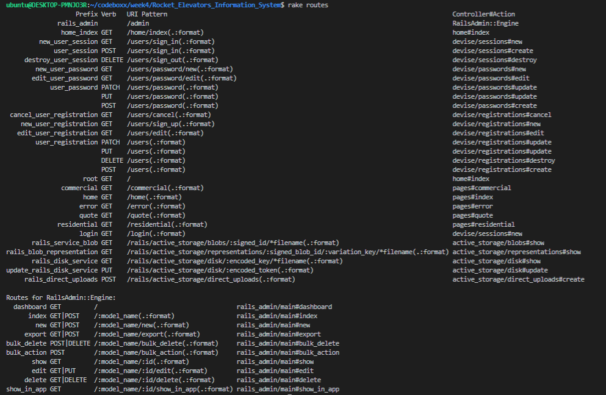

# Rocket_Elevators_Information_System
Application for website of the Company of Rocket Elevators
## URL
<https://rocketmax.xyz/>
## Gems used
* gem 'devise'


* gem 'rails-admin'


* gem 'faker'


* gem 'rubocop'
      https://github.com/rubocop-hq/rubocop
* gem 'sprockets-rails'
      https://github.com/rails/sprockets-rails/
* gem 'hirb'
      http://tagaholic.me/hirb/doc/index.html
      to use open -  
                  -open rails console in terminal
                  -run : Hirb.enable ( everytime you open the console)
* cancancan
* df
* fd
* 

### pour la creation des tables dans mysql avec model
rails g model TableName
pour Quotes Employees Users

### pour les seeds

## Infos development:
### After pull:
```
bundle install
rails db:drop
rails db:create
rails db:migrate
rails db:seed ( if you want to populate your database )
```
📚 Instructions to acces to the admin panel:

To log as Admin:

```sh
1. Navigation bar : Member
2. Login
3. Username: mathieu.houde@codeboxx.biz
   password: 123456
4. Member : Admin Panel
```

## :memo: Routes

- homepage: <b>/</b>
- residential page: <b>/residential</b>
- commercial page: <b>/commercial</b>
- form page: <b>/form</b>
- thank you page: <b>/thank-you</b>
- Admin panel: <b>/admin</b>

```sh
rake routes
```



# README

This README would normally document whatever steps are necessary to get the
application up and running.

Things you may want to cover:

* Ruby version

* System dependencies

* Configuration

* Database creation

* Database initialization

* How to run the test suite

* Services (job queues, cache servers, search engines, etc.)

* Deployment instructions

* ...
# Rocket_Elevators_Information_System
